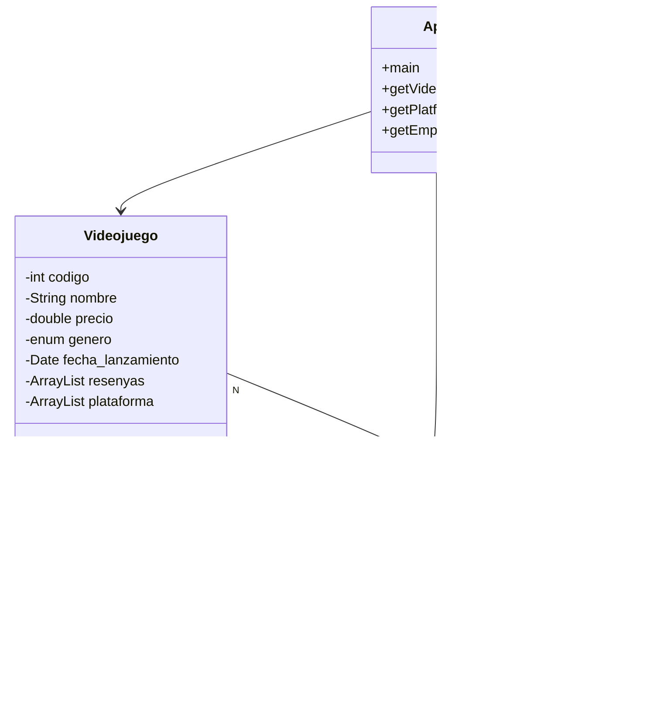

# Ver los juegos y consolas 

```mermaid
 classDiagram
    Videojuego "1" *--   "1" Resenya
    Videojuego "N" <--> "N" Plataforma
    Videojuego "N" --o "1" Empresa  
    App --> Videojuego
    App --> Empresa
    App --> Plataforma
    class Videojuego {
        -int codigo
        -String nombre
        -double precio
        -enum genero
        -Date fecha_lanzamiento 
        -ArrayList resenyas <Resenya>
        -ArrayList plataforma <Plataformas>
    }
    class Plataforma {
        -int codigo
        -String modelo
        -enum marca
        -String color
        -int capacidad
        -Videojuego videojuego 
    } 
    class Empresa {
        -int codigo 
        -String nombre
        -int anyos_actividad
        -ArrayList videojuegos <Videojuego>
    }
    class  Resenya {
        - double puntuacion
        - String Comentarios
        -Date Fecha
    }
    class App {
        +main 
        +getVideojuego
        +getPlatfroma
        +getEmpresa  
    }
```

